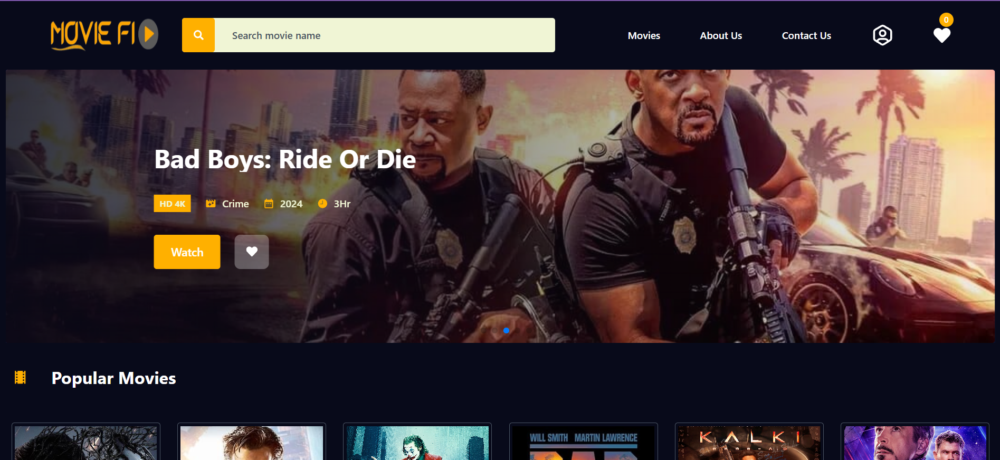
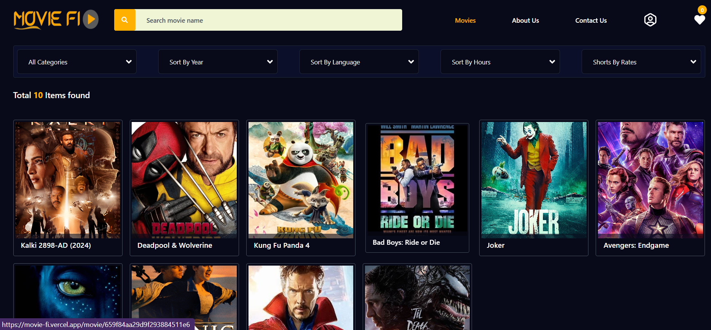
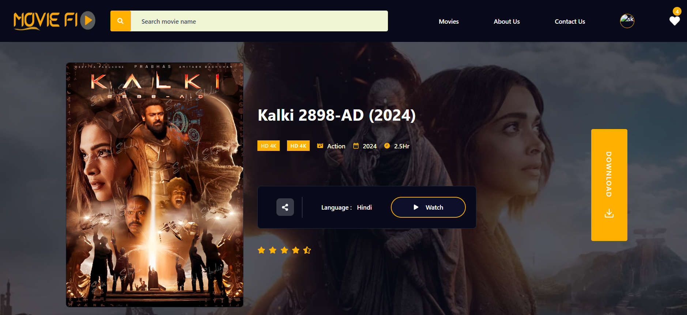
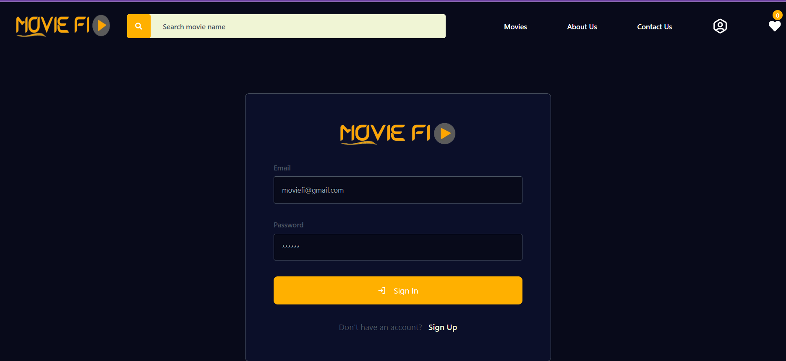
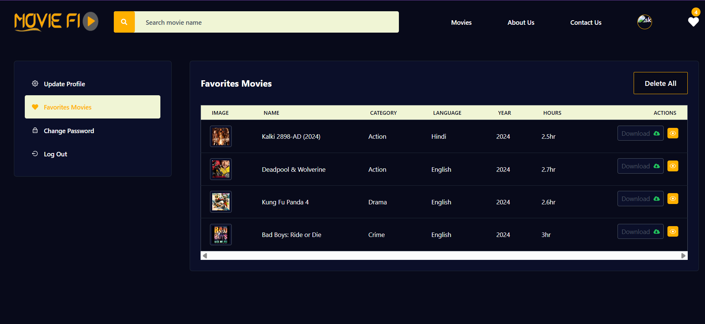
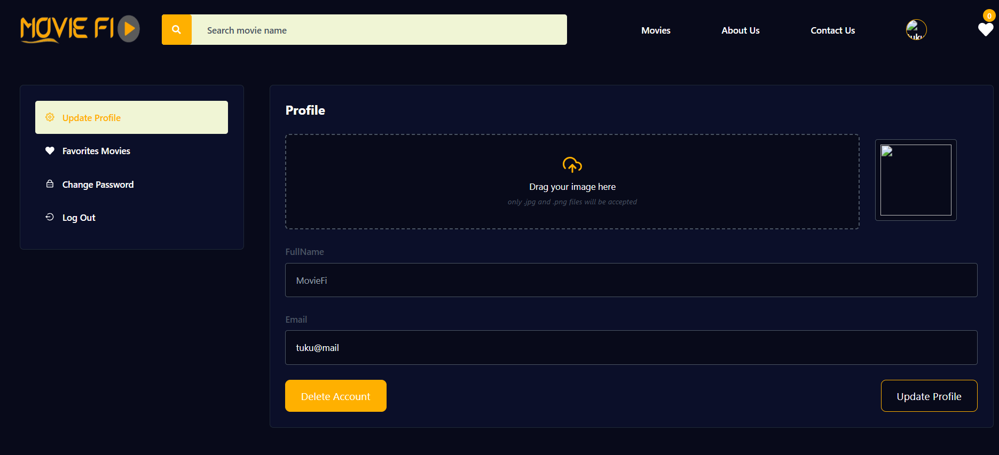

# 🎬 Movie-Fi


A **full-stack movie website** where users can browse, filter, review, and rate movies.  
Built with **React, Node.js, MongoDB, Firebase, and Tailwind CSS**.

---

## 🚀 Live Demo
🔗 **[Movie-Fi Website](https://movie-fi.vercel.app)**

---

## 📸 Screenshots

### Home Page


### All Movies Page


### Movie Details Page


### LogIn Page


### Favorites Movies Page


### Profile Page

---

## ✨ Features
- 🔑 **User authentication** with JWT
- 🎞️ Browse and **filter movies** by category, language, and year
- ⭐ Add **ratings, likes, and reviews**
- 📝 **Admin panel** for movie CRUD operations
- 📱 Fully **responsive design** with Tailwind CSS

---

## 🛠 Tech Stack
**Frontend (client):** React, Redux Toolkit, Tailwind CSS  
**Backend (server):** Node.js, Express.js, MongoDB, Firebase (Firestore)  
**Deployment:** Vercel (frontend), Render/Other (backend)

---

## 📦 Installation

Follow these steps to run Movie-Fi locally:

### 1️⃣ Clone the Repository
```bash
git clone https://github.com/Kabri108/moviefi.git
cd moviefi
